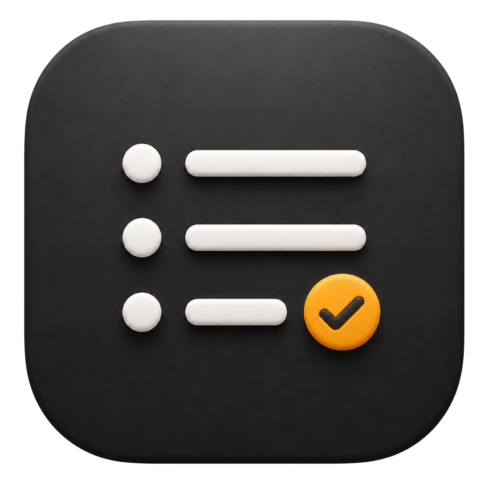
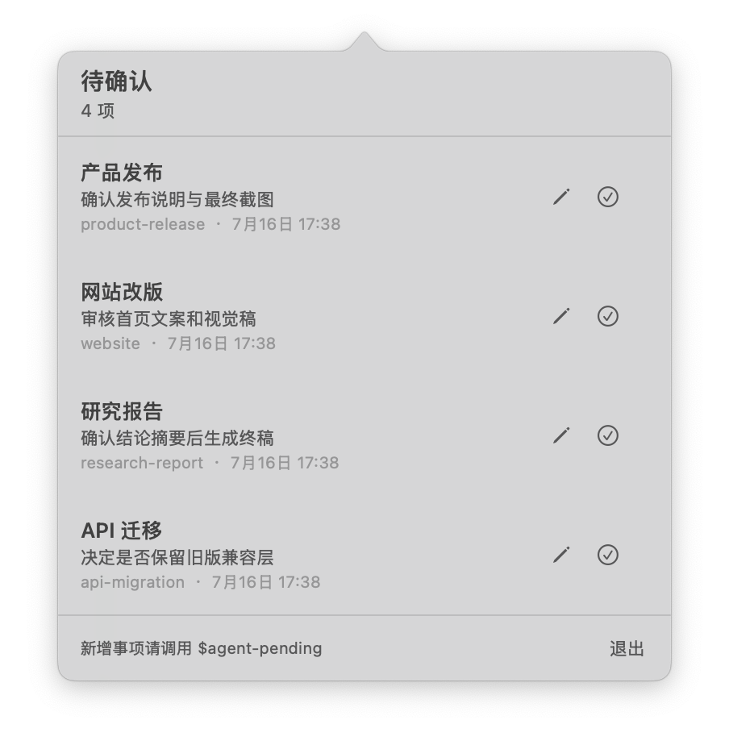

# Agent Pending

<p align="center">
  
</p>

<p align="center">
  面向 AI Agent 工作流的极简“仍需我处理”清单。<br>
  <a href="README.en.md">English</a>
</p>

<p align="center">
  
</p>

Agent Pending 把散落在不同终端、项目和对话中的人工下一步，收进 Mac 菜单栏的一份本地清单。它既可以记录审批，也可以记录未完成任务、后续动作或愿望；共同点是：这件事仍然需要你处理，Agent 不能自行完成。

它不是项目管理器，也不会自动抓取任务。只有当你明确调用 `$agent-pending` 或明确要求使用 Agent Pending 时，Agent 才新增一条记录。

## 功能

- 菜单栏常驻图标显示当前待处理数量，左键打开或收起列表。
- 每项显示标题、一个明确的下一步、工作区名称和记录时间；悬停可查看完整工作区路径。
- 可在界面中编辑记录，或标记完成并移入归档。
- CLI 支持新增、查看、归档、恢复；相同记录默认不会重复添加。
- 检测到新记录时发送一次 macOS 通知。
- 界面支持中文和 English，首次启动默认中文；右键菜单栏图标可切换语言。
- 数据只保存在本机，安装后随登录启动，随时可以退出。

这里的“提醒”指菜单栏的持续可见计数和新记录通知，不是截止日期或周期提醒。列表没有 10 条或 20 条的硬限制并支持滚动，但产品刻意面向一份短小、可行动的人工队列。

## 安装

要求 macOS 13 或更高版本，并已安装 Xcode Command Line Tools。

```bash
git clone https://github.com/GeorgeDu/agent-pending.git
cd agent-pending
./scripts/install.sh
```

安装过程不需要 `sudo`，默认位置如下：

- App：`~/Applications/Agent Pending.app`
- CLI：`~/.local/bin/agent-pending`
- Skill 源目录：`~/.agents/skills/agent-pending`
- 数据：`~/Library/Application Support/Agent Pending/store.json`

安装脚本会在 Codex 和 Claude Code 的技能目录可用时创建软连接，并注册登录启动。退出 App 后不会在当前登录会话中自行重启；可从 `~/Applications/Agent Pending.app` 再次打开。

## 使用

### 让 Agent 记录

必须显式调用：

```text
$agent-pending 记录一下：发布前我需要确认最终文案。
```

每次调用只写入一条记录。Skill 会从上下文概括标题与下一步，并保存当前项目根目录；它不会扫描项目文件，也不会寻找其他未完成任务。

### 在菜单栏处理

- 左键图标：打开或收起待处理列表。
- 铅笔：编辑标题和下一步。
- 对勾：完成并归档。
- 右键图标：显示列表、切换中英文、重启或退出。

目前归档列表只通过 CLI 查看和恢复，GUI 不展示历史记录。

### 直接使用 CLI

```bash
agent-pending add \
  --title "发布确认" \
  --note "发布前批准最终文案" \
  --workspace "$PWD"

agent-pending list --json
agent-pending complete <item-id>
agent-pending archive --json
agent-pending restore <item-id>
```

## 工作方式

```text
你显式调用 Skill
        ↓
Agent 将一条记录交给本地 CLI
        ↓
CLI 原子写入本地 JSON
        ↓
菜单栏 App 刷新计数、列表和一次性通知
```

记录只有四个核心字段：标题、下一步、工作区路径、时间。工作区路径只是定位信息，App 和 Skill 不会因此读取项目内容。

## 不会做什么

Agent Pending v0.1 有意不提供：

- 自动发现、自动记录或后台扫描任务
- 优先级、标签、项目层级、截止时间和周期提醒
- 云同步、账号、团队权限或协作看板
- GUI 中的归档历史管理

如果它逐渐变成另一套复杂项目管理系统，就偏离了产品目的。

## 隐私

App 只读写自己的本地数据目录。标题与下一步可能显示在 macOS 通知中；可在系统设置里关闭通知预览。仓库不会保存用户数据，`store.json`、锁文件和构建产物均被 Git 忽略。

## 模拟运行状态与截图

仓库提供一个完全隔离的演示模式。它在临时目录构建 App、写入四条虚构事项并自动打开列表，不会读取或修改正式数据：

```bash
./scripts/demo.sh
```

按 `Control-C` 后，演示进程和临时数据会被删除。需要英文界面时：

```bash
AGENT_PENDING_LANGUAGE=en ./scripts/demo.sh
```

在 macOS 中可按 `Shift-Command-4` 后按空格，点选浮窗进行截图。提交截图前确认画面只包含演示事项。

要将浮窗定位到 Retina 主屏中央以生成高清文档截图：

```bash
AGENT_PENDING_SCREENSHOT_MODE=1 ./scripts/demo.sh
```

## 构建与测试

```bash
/usr/bin/python3 tests/test_agent_pending.py
/usr/bin/python3 tests/test_public_repo.py
./scripts/build.sh
```

v0.1 会在本机编译并进行 ad-hoc 签名；仓库暂不提供经过 Apple 公证的二进制安装包。

## 卸载

```bash
./scripts/uninstall.sh
```

默认保留数据。连同数据删除：

```bash
./scripts/uninstall.sh --purge-data
```

## 许可

[MIT](LICENSE)
